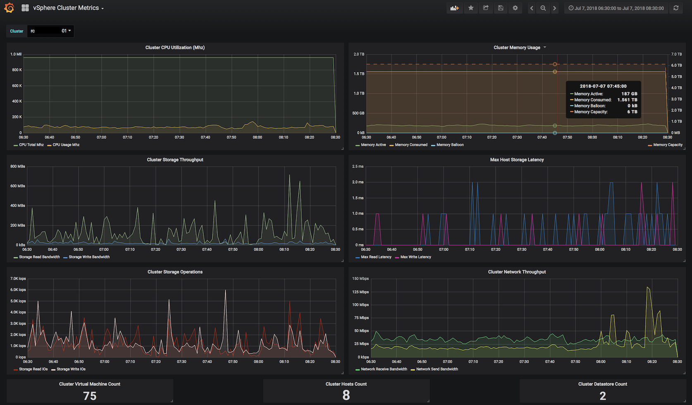

# vSphere Graphite [](Open+up++your+%20vmware+%20vsphere+statistics+with+https://github.com/cblomart/vsphere-graphite)

[](https://cloud.drone.io/cblomart/vsphere-graphite) [](https://goreportcard.com/report/github.com/cblomart/vsphere-graphite) [](https://app.fossa.io/projects/git%2Bgithub.com%2Fcblomart%2Fvsphere-graphite?ref=badge_shield) [](https://en.cryptobadges.io/donate/1BQqpYfQc9NqykaK4rEH5bFsik1VffKHmQ)

Monitors VMware vSphere stats using govmomi. Sinks metrics to one of many time series backends.

Written in go to achieve fast sampling rates and high throughput sink. Successfuly benchmarked against 3000 VM's, logging 150,000 metrics per minute to an ElasticSearch backend.

Compatible backends:

* [prometheus](https://prometheus.io/)
* [influxdb](https://www.influxdata.com/)
* [fluentd](https://www.fluentd.org/)
* [elasticsearch](https://www.elastic.co/)
* [graphite](https://graphiteapp.org/)

## Example dashboard

The dashboard example below is using the grafana UI. The backend is using ElasticSearch.



## Configuration

Define vSphere credentials and collection metrics in the JSON config file. An example configuration for the Contoso domain is found [here](./vsphere-graphite-example.json).

Copy this config file to /etc/*binaryname*.json and modify as needed. 
As in windows "/etc" doesn't exist, the configuration file should be placed in the same directory as the vsphere-graphite binary.

Example:
> cp vsphere-graphite-example.json /etc/vsphere-graphite.json


<!-- provide link to vcenter roles and permissions -->

Metrics collection is performed by associating ObjectType groups with Metric groups.
These are expressed via the vsphere scheme: *group*.*metric*.*rollup*

ObjectTypes are explained in [this](https://code.vmware.com/web/dp/explorer-apis?id=196) vSphere doc.

Performance metrics are explained in [this](https://docs.vmware.com/en/VMware-vSphere/6.5/com.vmware.vsphere.monitoring.doc/GUID-E95BD7F2-72CF-4A1B-93DA-E4ABE20DD1CC.html) vSphere doc.

You can select the extra data collected by using the "Properties" property:

* datastore: reports the datastores associated with a virtual machine
* host: reports the host the virtual machine runs on
* cluster: reports the cluster the virtual machine is in
* network: reports the network the virtual machine is connected to
* resourcepool: reports the resourcepool the virtual machine is in
* folder: reports the folder the virtual machine is in
* tags: reports the tags associated with the virtual machine
* numcpu: reports the number of virtual cpus the virtual machine has
* memorysizemb: reports the quantity of memory the virtual machine has
* disks: reports the logical disks capacity inside the virtua machine
* **all**: reports all the information

### vCenter parameters

vCenter parameters can be set in the configuration file or via environement variable.

The configuration file needs the username, password and hostname of the vCenter (from [sample config](./vsphere-graphite-example.json)):

```json
"VCenters": [
    { "Username": "CONTOSO\\Administrator", "Password": "$P@ssw0rd", "Hostname": "vc1.contoso.com" },
    { "Username": "CONTOSO\\Administrator", "Password": "$P@ssw0rd", "Hostname": "vc2.contoso.com" }
]
```

If set via environement variable you can set multiple vcenters via ```VCENTER_*=<username>:<password>@<hostname>```

To follow the example given in the sample file:
```
VCENTER_VC1=CONTOSO\\Administrator:$P@ssw0rd@vc1.consoso.com
VCENTER_VC2=CONTOSO\\Administrator:$P@ssw0rd@vc2.consoso.com
```

### Backend parameters

Backend parameters can be set in the config and will allways be overriden by environment variables.
This allows to use a generic config in a container image and set the backend by environement variables.

* Type (CONFIG_TYPE): 

  Type of backend to use.

  Currently "graphite", "influxdb", "thinfluxdb" (embeded influx client), "elastic", "prometheus", "thinprometheus" (embeded prometheus) and "fluentd"

* Hostname (CONFIG_HOSTNAME):

  Hostname were the backend is running.

  Prometheus will use this information to choose which interface (ip address) it listens to. An empty value means all interfaces. 
  
  i.e: 127.0.0.1 would limit to localhost.

* Port (CONFIG_PORT):

  Port to connect to for the backend.

  Prometheus will use this to choose which port to listen to. By default it listens to port 9155.

* Encrypted (CONFIG_ENCRYPTED):

  Enable or disable TLS to the backend (true, false).

  Only supported by "influx", "thininflux" and "elastic" backends.

>
> Prometheus suppport for this would require certificate management.
>

* Username (CONFIG_USERNAME):

  Username to connect to the backend.

  Only supported by "influx" and "thininflux" backends.
  
* Password (CONFIG_PASSWORD):

  Password to connect to the backend.

  Only supported by "influx" and "thininflux" backends.

* Database (CONFIG_DATABASE):

  Database to use in the backend.

  Only supported by "influx", "thininflux" and "elastic".

* NoArray (CONFIG_NOARRAY):

  Multiple values metadata will be send as csv 'array' by default (NoArray is true by default).
  If set to false, only the first element is sent.

* Prefix (CONFIG_PREFIX):

  Prefix to use in the backend.

## Execute vsphere-graphite as a container

All builds are pushed to docker:

* [cblomart/vsphere-graphite](https://hub.docker.com/r/cblomart/vsphere-graphite/)
* [cblomart/rpi-vsphere-graphite](https://hub.docker.com/r/cblomart/rpi-vsphere-graphite/)

Default tags includes:

* commit for specific commit in the branch (usefull to run from tip)
* latest for latest release
* specific realease tag or version

The JSON configration file can be passed by mounting to /etc. Edit the configuration file and set it in the place you like here $(pwd)

  > docker run -t -v $(pwd)/vsphere-graphite.json:/etc/vsphere-graphite.json cblomart/vsphere-graphite:latest

Backend parameters can be set via environment variables to make docker user easier (having graphite or influx as another container).

## Execute vsphere-graphite in swarm (docker-compose)

A sample [docker compose file](./compose/vsphere-graphite-graphite-test.yml) is provided in the project.
this sample will start:

* vcsim ([vCenter simulator by govmomi](https://github.com/vmware/govmomi/tree/master/vcsim))
* graphite (["Offical" Graphite docker image](https://hub.docker.com/r/graphiteapp/graphite-statsd/)) the port 80 will be published to access the web interface.
* vsphere-graphite with the necessary environement parameters to address the started backend and vcenter

To start this with swarm:

```bash
> docker stack deploy -v vsphere-graphite-graphite-test.yml vsphere-graphite
```

> Did you know that you can run docker stack on a standalone host... so no need for docker-compose. Just:
>
> ```bash
> > docker swarm init
> ```

## Execute vsphere-graphite in shell

Heavilly based on [govmomi](https://github.com/vmware/govmomi) but also on [daemon](github.com/takama/daemon) which provides simple daemon/service integration.

### Install golang

Of course [golang](https://golang.org) is needed.
refer to [install](https://golang.org/doc/install) and don't forget to set `$GOPATH`.

Gopath example:

```bash
mkdir /etc/golang
export GOPATH=/etc/golang
```

Then install vsphere-graphite with GO:

  > go get github.com/cblomart/vsphere-graphite

The executable should be `$GOPATH/bin/vsphere-graphite` and is now a binary for your architecture/OS

### Run on Commandline

  > vsphere-graphite

### Install as a service

  > vsphere-graphite install

### Run as a service

  > vsphere-graphite start
  >
  > vsphere-graphite status
  >
  > vsphere-graphite stop

### Remove service

  > vsphere-graphite remove

## Contributors

No open source projects would live and thrive without common effort. Here is the section were the ones that help are thanked:

* [sofixa](https://github.com/sofixa)
* [BlueAceTS](https://github.com/BlueAceTS)
* [NoMotion](https://github.com/NoMotion)
* [korservick](https://github.com/korservick)
* [MnrGreg](https://github.com/mnrgreg)
* [fdmsantos](https://github.com/fdmsantos)
* [dupondje](https://github.com/dupondje)
* [jlothian](https://github.com/jlothian)

Also keep in mind that if you can't contribute code, issues and improvement requests are also a key part of a project evolution!
So don't hesitate and tell us what doesn't work or what you miss.

## Donations

This project is largely alive because of the forementioned contributors. Our time is precious bet it is even more precious to us when we can spend it on our beloved projects. So don't hesitate to make a donation (see badge)

## License

The MIT License (MIT)

Copyright (c) 2016 cblomart

Permission is hereby granted, free of charge, to any person obtaining a copy of this software and associated documentation files (the "Software"), to deal in the Software without restriction, including without limitation the rights to use, copy, modify, merge, publish, distribute, sublicense, and/or sell copies of the Software, and to permit persons to whom the Software is furnished to do so, subject to the following conditions:

The above copyright notice and this permission notice shall be included in all copies or substantial portions of the Software.

THE SOFTWARE IS PROVIDED "AS IS", WITHOUT WARRANTY OF ANY KIND, EXPRESS OR IMPLIED, INCLUDING BUT NOT LIMITED TO THE WARRANTIES OF MERCHANTABILITY, FITNESS FOR A PARTICULAR PURPOSE AND NONINFRINGEMENT. IN NO EVENT SHALL THE AUTHORS OR COPYRIGHT HOLDERS BE LIABLE FOR ANY CLAIM, DAMAGES OR OTHER LIABILITY, WHETHER IN AN ACTION OF CONTRACT, TORT OR OTHERWISE, ARISING FROM, OUT OF OR IN CONNECTION WITH THE SOFTWARE OR THE USE OR OTHER DEALINGS IN THE SOFTWARE.

## Licenses dependencies

[](https://app.fossa.io/projects/git%2Bgithub.com%2Fcblomart%2Fvsphere-graphite?ref=badge_large)
